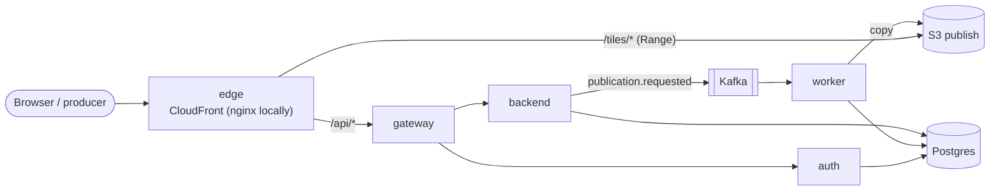

# PMTiles publishing platform

## 1. Challenge requirements

Take a PMTiles archive from a private AWS staging environment, publish it
through an asynchronous workflow and show it in a browser.

| Requirement | Where |
|---|---|
| Request the publication of a dataset | `POST /api/v1/publications`, upload page — [backend](docs/decisions/backend_service.md) |
| Follow the job status and identify the published version | live job table (SSE), `GET /api/v1/publications/{id}` |
| Display the dataset on a minimal web map | `map.html`, HTTP range requests — [web app](docs/decisions/web_app.md) |
| Recover safely from failed or repeated publications | idempotency key, conditional claim, leases, reconciler — [worker](docs/decisions/worker.md) |
| Deploy and update reproducibly | `make up` locally, `make aws-up` on AWS |
| AWS + EKS + Terraform | [`deploy/terraform`](deploy/terraform), Helm charts in [`deploy/helm`](deploy/helm) |
| Kafka-compatible broker | Redpanda; MSK as the production target — [kafka](docs/decisions/kafka.md) |
| Request-facing vs background separation | backend (API) vs worker (Kafka consumer) |
| Delivery: AWS vs Cloudflare R2 compared, one implemented | CloudFront + S3 implemented; R2 comparison with traffic and caching assumptions — [tile serving](docs/decisions/tile_serving.md#aws-cloudfront--s3-vs-cloudflare-r2) |
| Traffic or publication jobs increase | CDN absorbs reads; HPA, KEDA on Kafka lag, Cluster Autoscaler — [scaling](docs/decisions/scaling.md) |
| Private, tenant-only datasets | CloudFront signed cookies — [tile serving](docs/decisions/tile_serving.md) |

## 2. How it works

A client stages a `.pmtiles` file and requests a publication. The backend
records a job and emits a Kafka event. A worker validates and hashes the
archive, copies it to an immutable content-addressed key, and in one
transaction records the version and moves the dataset pointer. The map reads
the current version straight from the CDN with range requests. Private
datasets need a tenant-scoped signed cookie.



**→ [Architecture](docs/architecture.md)**: each component, with a page on how
it works, the alternatives and the cost.
Also: [AWS mapping](docs/aws-mapping.md) · [cost](docs/cost.md) ·
[runbook](docs/runbook.md) · [CI/CD setup](docs/ci-cd.md) ·
[decision log](docs/DECISIONS.md) ·
[event schemas](docs/events/)

## 3. Quickstart (local)

Needs Docker with Compose v2, GNU Make, `curl` and `python3`.

```bash
make up      # build and start everything (~2 min the first time)
make seed    # demo tenants, users and a producer API key
make demo    # publish a sample archive and print the map URL
```

Open **http://localhost:8080** and sign in:

| User | Password | Tenant |
|---|---|---|
| `alice@tenant-a.test` | `demo-password-alice` | tenant-a (owner) |
| `bob@tenant-b.test` | `demo-password-bob` | tenant-b (member) |
| `admin@platform.test` | `demo-password-admin` | platform admin |

Upload page: http://localhost:8080/upload.html · Kafka console:
http://localhost:8081 · `make up PROFILE=observability` adds Grafana (:3001),
Jaeger (:16686) and Prometheus (:9090).

```bash
make down    # stop, keep data
make clean   # stop, delete volumes and dev keys
```

## 4. Quickstart (AWS)

Needs Terraform ≥ 1.10, AWS CLI v2, Docker, and AWS credentials in the shell
(e.g. `export AWS_PROFILE=...`). Details: [deploy/README.md](deploy/README.md).

```bash
make aws-up                                          # ~40 min; prints the CloudFront url
make aws-add-user email=a@acme.com password='...'    # user in tenant "acme-com"
make aws-down                                        # destroy everything
```

About **$0.43/hour** while it is up ([cost](docs/cost.md)).

## 5. Demo scripts

| Command | What it shows |
|---|---|
| `make demo` | Stage → publish → wait → `206` range read → map URL. `VISIBILITY=private`, `f=file.pmtiles`, `slug=name` |
| `make synthetic` | Generates `sample-data/synthetic.pmtiles` with tippecanoe (used by `demo` if no sample archive) |
| `make chaos-duplicate` | Replays a publication message verbatim → still one version |
| `make chaos-crash-after-copy` | Kills the worker between S3 copy and DB commit → reconciler recovers to the same single version |
| `make dlq` | Prints the dead-letter topic |
| `make aws-demo email=... password=...` | On AWS: private publish, then CloudFront miss → hit → `403` without cookies |

Private tiles by hand: `VISIBILITY=private make demo`, open the map as Alice
(tiles load), then as Bob (tiles are `403`).

## Hours spent

About **27 hours**:

| Day | Hours | Work |
|---|---:|---|
| 23 Sep | 4 | Read the task, research, brainstorm the implementation |
| 24 Sep | 4 | Initial local implementation |
| 25 Sep | 4 | Review, debug and fix the local implementation |
| 28 Sep | 6 | Cloud deployment |
| 29 Sep | 6 | Review and debug the cloud deployment |
| 30 Sep | 3 | Documentation |
