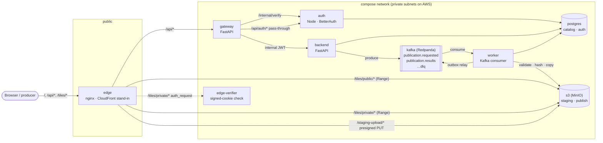

# PMTiles publishing platform

Publishes [PMTiles](https://github.com/protomaps/PMTiles) archives through an
asynchronous, Kafka-based workflow and serves them to a browser map with HTTP
range requests. Multi-tenant, with public and private datasets.

This is the **local** implementation: everything runs with `docker compose`.
It is built so that moving to AWS is a configuration change rather than a
rewrite — see [`docs/aws-mapping.md`](docs/aws-mapping.md).



**The publication flow.** A client stages a `.pmtiles` file, then calls
`POST /api/v1/publications` with an `Idempotency-Key`. The backend commits a
`PENDING` job and emits `publication.requested`. A worker claims the job,
validates the PMTiles header with one 127-byte range read, streams the object
through SHA-256, copies it server-side to an immutable content-addressed key,
and in one transaction records the version, moves the dataset pointer, finishes
the job and writes the result event to an outbox. The map then asks
`/datasets/{id}/current` for the archive URL and reads it with range requests.

## Prerequisites

* Docker with Compose v2 (tested with Docker 29, Compose 5)
* GNU Make, `curl`, `python3` (for the demo script); `jq` is handy for
  the manual checks below but not required
* For development only: [`uv`](https://docs.astral.sh/uv/) and Node 22+

Nothing else is installed on the host; every service runs in a container.

## Quick start

```bash
make up      # build and start everything; waits until healthy (~2 min first time)
make seed    # demo tenants and users; producer API key -> dev-keys/producer-api-key
make demo    # as the tenant-a producer: stage, publish, wait, verify a 206, print the map URL
```

> **Upgrading an existing checkout:** the catalogue migrations were folded into
> one, so a database created by an earlier version will not migrate. Run
> `make clean` (drops the local volumes and dev keys) before `make up`.

New datasets are **private** unless the publication request says
`"visibility": "public"`; `make demo` publishes publicly by default.

Then open **http://localhost:8080** and sign in:

| User | Password | Tenant | Role |
|---|---|---|---|
| `alice@tenant-a.test` | `demo-password-alice` | tenant-a | owner |
| `bob@tenant-b.test` | `demo-password-bob` | tenant-b | member |
| `admin@platform.test` | `demo-password-admin` | — | platform admin |

These are local-only demo accounts, not secrets.

The sign-in form is at the top of the datasets page while you are signed out.

### Adding tenants and users

```bash
make add-tenant slug=acme name="Acme Corp"
make add-user email=carol@acme.test password=carol-password-1 tenant=acme role=owner
make add-user email=ops@example.test password=ops-password-1 admin=1   # platform admin
make list-users
```

`role` is `owner`, `admin` or `member` (default `member`); passwords need 10+
characters. A user added without `tenant=` can sign in and see public datasets
but cannot publish until added to a tenant. Re-running `add-user` for an
existing email keeps their password and only adds the membership or role.
There is deliberately no public self-sign-up: tenants are provisioned by an
operator.

### Sample data

`sample-data/input_forest_crowns_pmtiles.spec.json` is committed; the archive
`sample-data/input_h3_multires.pmtiles` is not (it is 7 MB of someone else's
data). If it is absent, `make demo` generates a synthetic archive of the same
shape with tippecanoe (the first run builds tippecanoe, ~2 minutes):

```bash
make synthetic    # sample-data/synthetic.pmtiles
```

### Other ways in

```bash
VISIBILITY=private make demo           # publish a private dataset
make up PROFILE=observability          # + Prometheus, Grafana, Jaeger
make up PROFILE=debug                  # + host ports for postgres, kafka, s3, gateway, auth, backend, worker
```

| URL | What |
|---|---|
| http://localhost:8080 | Datasets, sign-in, versions, jobs |
| http://localhost:8080/upload.html | Browser upload (presigned PUT through the edge) and the live publication-jobs table; only when `DEMO_UPLOAD_ENABLED=true` |
| http://localhost:8080/map.html?dataset=… | The map |
| http://localhost:8081 | Redpanda Console (topics, messages, consumer lag) |
| http://localhost:3001 | Grafana (`observability` profile) |
| http://localhost:16686 | Jaeger (`observability` profile) |
| http://localhost:9090 | Prometheus (`observability` profile) |

Only the edge (`:8080`) and the developer UIs are published on the host. The
gateway, auth, backend, worker, Postgres, Kafka and the object store are
reachable only inside the compose network, as they would be on AWS.

## Validating it by hand

**Range requests.** Open a map, then DevTools → Network, filter on `pmtiles`.
Every archive request should be **`206 Partial Content`** with a `Range`
request header and `Content-Range`, `Accept-Ranges: bytes` and an `ETag` in the
response. The archive URL contains its content hash and is served with
`Cache-Control: public, max-age=31536000, immutable`; `/datasets/{id}/current`
is `max-age=30`, so a new version shows up within 30 seconds while the tiles
themselves are never revalidated.

```bash
curl -sI -r 0-126 "http://localhost:8080$(curl -s localhost:8080/api/v1/datasets/<id>/current | jq -r .url)"
```

**Private tiles.** Publish with `VISIBILITY=private make demo`, sign in as Alice
and open the map: the page calls `POST /api/v1/tiles/session` first and the
browser then holds three `CloudFront-*` cookies scoped to `/tiles/private/`.
Sign in as Bob and open the same map: the tiles are `403` — Bob's cookie is
valid, but for tenant-b.

**Versioning and rollback.** A version is the archive bytes *plus* the
layer/style spec: republishing the same file with an edited spec creates a new
version (sharing the stored object), while the same file and same spec is
`DEDUPLICATED`. Publish two different archives to the same slug,
then use *Versions → Make current* on the datasets page. Rollback moves a
pointer; nothing is copied or deleted.

## Chaos scenarios

At-least-once delivery is only credible if the duplicate and crash cases are
demonstrated, not asserted.

```bash
make chaos-duplicate          # replay a publication message verbatim → still one version
make chaos-crash-after-copy   # kill the worker between the S3 copy and the DB commit
```

Both run the matching e2e test (`tests/e2e/test_chaos.py`), so they need
`make up && make seed` first. `chaos-crash-after-copy` restarts the worker with `CHAOS_CRASH_AFTER_COPY=1`,
publishes, waits for it to die, restarts it normally, and checks that the
reconciler recovered the job to the **same** content hash as **one** version row
— the second attempt skips the copy because the object is already in place.
Other switches: `CHAOS_CRASH_BEFORE_OFFSET_COMMIT`, `CHAOS_DELAY_MS`. Each is
off by default and logged at `error` level when on.

`make dlq` prints the dead-letter topic. `docs/runbook.md` covers inspecting and
replaying it.

## Tests

```bash
make test    # unit tests: Python (pytest), frontend (node --test), auth (vitest)
make lint    # ruff, ruff format, mypy --strict, tsc, prettier
make e2e     # end-to-end against the running stack (needs make up && make seed)
```

The e2e suite runs every scenario from the brief against the real stack through
the public edge: publish/206, idempotent replay, deduplication, rollback,
duplicate Kafka delivery, crash-after-copy recovery, invalid-file failure and
retry, private-tile tenant isolation, forged identity rejection, revocation
within the verify-cache TTL, and `Set-Cookie` preservation through the gateway.
`E2E_SKIP_SLOW=1` skips the one test that restarts the worker.

## Repository layout

```
packages/common/     shared Python library (config, events, identity, logging,
                     metrics, tracing, Kafka/DB/S3 helpers, PMTiles, versioning)
services/backend/    catalogue API                       (FastAPI)
services/gateway/    API gateway + routes.yaml           (FastAPI)
services/worker/     Kafka consumer, outbox, reconciler  (plain Python)
services/edge-verifier/  signed-cookie check, local only (FastAPI)
services/auth/       identity                            (Node, BetterAuth)
services/edge/       nginx config                        (CloudFront stand-in)
web/                 static pages, no build step
migrations/          Alembic, `catalog` schema
ops/                 DB roles/grants, init scripts, Dockerfiles, observability
scripts/             demo, key generation, synthetic data, event schemas
tests/e2e/           end-to-end suite
docs/                decisions, AWS mapping, runbook, event schemas
```

## Documentation

* [`docs/DECISIONS.md`](docs/DECISIONS.md) — every non-obvious choice, the
  alternatives, and why.
* [`docs/aws-mapping.md`](docs/aws-mapping.md) — what each local component
  becomes on AWS, the config that changes, IAM per service.
* [`docs/cost.md`](docs/cost.md) — what the AWS deployment costs, and where to
  save.
* [`docs/runbook.md`](docs/runbook.md) — stuck jobs, the DLQ, retries,
  rollback, worker crashes, outbox backlog, auth outages, revoking a user.
* [`docs/events/`](docs/events/) — JSON Schema for every Kafka event.

## Cleanup

```bash
make down    # stop, keep data
make clean   # stop, delete volumes and the generated dev keys
```

## Hours spent

_To be filled in by the author._
