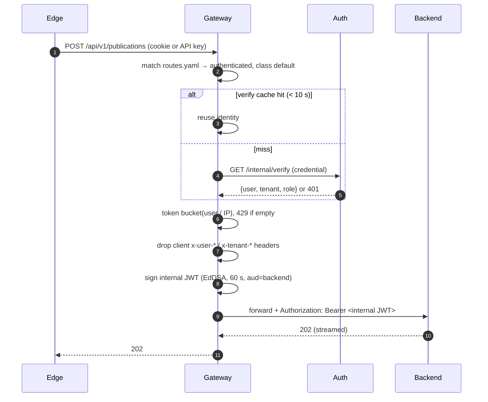

# API gateway service

A small FastAPI service (`services/gateway/`) and the single entry point for
`/api/*`:

- **Allowlist routing** from `routes.yaml`: longest prefix wins, anything
  unmatched is 404, so `/internal/*` and `/metrics` are unreachable from
  outside. Each route has a policy: `public`, `optional`, `authenticated`,
  `platform_admin`.
- **Strips client-supplied identity headers** before anything else.
- **Verifies the caller** with the auth service (`/internal/verify`); successes
  are cached for 10 s, which bounds how long a revoked session keeps working.
- **Rate limits** per route class, keyed by user id or `X-Client-IP`
  (in-memory token bucket, per replica).
- **Mints a 60 s EdDSA internal JWT** (`aud` = backend) so the backend never
  trusts headers, even if reached directly.
- `/api/auth/*` is passed through verbatim so every `Set-Cookie` survives.

## How it works

## Alternatives

| | Pros | Cons |
|---|---|---|
| **Chosen: custom FastAPI gateway** | ~few hundred lines, unit-tested; same logic locally and on AWS; policy lives in one readable file | We own the code and its bugs; per-replica rate limits; one more hop |
| **Envoy / Kong / Traefik in EKS** (`ext_authz` → `/internal/verify`) | Battle-tested proxy, rich rate limiting (Redis-backed), mTLS, retries; `ext_authz` could reuse the auth endpoint unchanged | Config as long as the code and harder to test; JWT minting needs a plugin or Lua; another technology for a small team |
| **AWS API Gateway + Lambda authorizer** | Managed, scales to zero, built-in throttling and usage plans for API keys | Per-request pricing; authorizer cold starts; SSE/streaming is limited; nothing runs locally, so local and AWS diverge |

## Cost

| Option | Estimate |
|---|---|
| Chosen: 2–6 pods on the shared nodes | Idle: 2 × 100m CPU / 256 Mi ≈ $7/month of t3.large capacity, plus the internal ALB ≈ $20/month (shared with all `/api/*`) |
| Envoy/Kong pods | Similar pod cost (≈ $7–15/month); + ElastiCache `cache.t4g.micro` ≈ $13/month for shared rate limits |
| AWS API Gateway (HTTP API) + Lambda | $1.20/1M requests + authorizer Lambda ≈ $0.20/1M + compute; ≈ $0 at demo volume, ≈ $35/month at 25M requests. Removes the ALB (−$20/month) |
