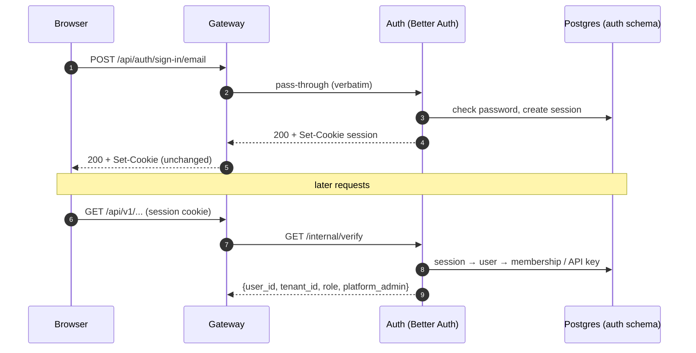

# Auth service

A Node service built on [Better Auth](https://www.better-auth.com/)
(`services/auth/`). It does **authentication only**; authorization is enforced
by the gateway (route policy) and the backend (tenant scoping). It provides:

- **Sessions** — email + password sign-in, HTTP-only session cookie.
- **Tenants** — Better Auth *organizations*, with `owner` / `admin` / `member`
  roles.
- **Platform admins** — a user-level role that can see every tenant.
- **API keys** — for machine producers (`make seed` writes one for the demo).
- **`/internal/verify`** — the one endpoint the gateway calls: credential in,
  `{user, tenant, role}` out. A single-membership user needs no active
  organization; with several and none chosen, the token has no tenant.

Self sign-up is disabled; users and tenants are provisioned by an operator
(`make add-user`, `users-cli`). Its tables live in the `auth` schema of the
same Postgres, owned by Better Auth's own migrator.

## How it works

## Alternatives

| | Pros | Cons |
|---|---|---|
| **Chosen: self-hosted Better Auth** | Organizations, roles, API keys out of the box; data stays in our Postgres; runs identically locally and on AWS; no per-user fees | We operate it (upgrades, password storage, rate limits); no SSO/SAML without extra plugins |
| **Amazon Cognito** | Managed, MFA and federation (SAML/OIDC), JWTs verifiable without a call | Multi-tenancy is DIY (groups/custom attributes); awkward local development; API keys not native; hard to migrate away |
| **Hosted IdP (Auth0 / Clerk / WorkOS)** | Best-in-class SSO, organizations, admin UI; fast to enterprise-ready | Per-MAU pricing, vendor lock-in, external dependency on every sign-in; data leaves our account |

## Cost

| Option | Estimate |
|---|---|
| Chosen: 2 pods + tables in the existing RDS | ≈ $7/month of node capacity; no licence; storage negligible |
| Cognito | Free up to 10k MAU (Lite tier), then ≈ $0.0055/MAU; SAML/OIDC federated users ≈ $0.015/MAU |
| Auth0 / Clerk / WorkOS | Free tiers for small MAU; B2B plans with organizations/SSO typically $150–$800+/month, SSO connections often priced per connection (~$125 each) |
