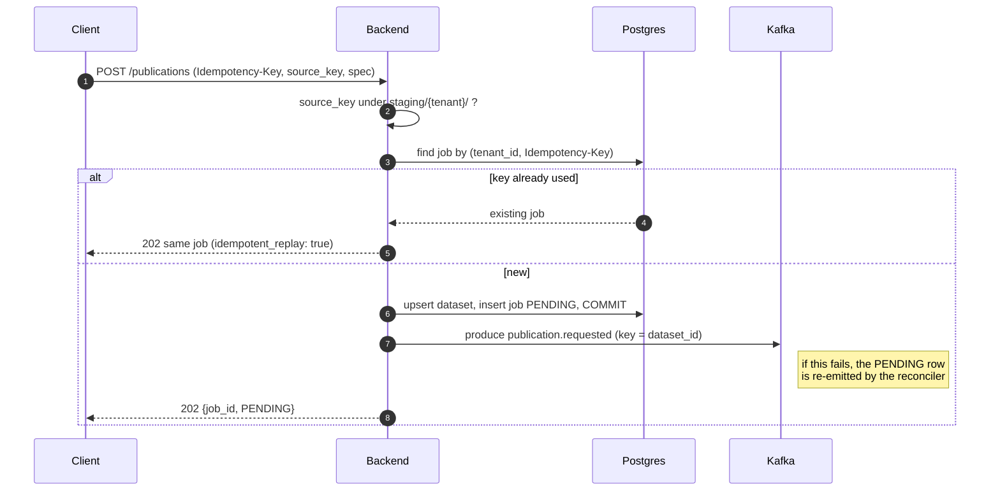
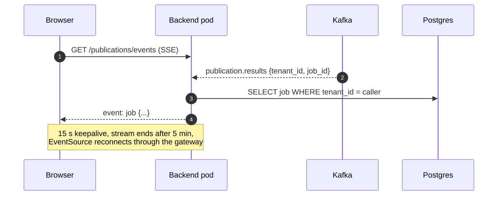

# Backend service

The catalogue API (`services/backend/`, FastAPI). It serves every `/api/v1/*`
method except auth and tile bytes, and trusts only the gateway's internal JWT.

- **Datasets** — list/get, versions, `/current` (30 s cacheable), rollback
  (`PUT` moves the current-version pointer). Every query is tenant-scoped.
- **Publications** — `POST /publications` creates the dataset (by tenant +
  slug) and a `PENDING` job, then produces `publication.requested`.
  - `Idempotency-Key` is required; a replay returns the same job.
  - The source key must be under the caller's staging prefix.
  - The job is **committed before** the event is produced; a lost event is
    recovered by the worker's reconciler.
  - `POST /publications/{id}/retry` re-queues a failed job.
- **Tile session** — `POST /tiles/session` issues CloudFront signed cookies
  scoped to `/tiles/private/{tenant}/*` (all tenants for platform admins).
- **Live job events** — each pod tails `publication.requested` and
  `publication.results` in a throwaway consumer group and fans changes out to
  the tenant's SSE streams, re-reading the job row before sending.
- **Demo upload** — presigned PUT to the staging bucket, bound to the file's
  sha256 (`DEMO_UPLOAD_ENABLED` only).

The backend never writes versions (`SELECT` only on `dataset_versions`); the
worker owns the versioning rules.

## How it works

## Alternatives

| | Pros | Cons |
|---|---|---|
| **Chosen: async API + Kafka + separate worker** | API latency independent of file size; workers scale on lag; crash-safe via claim/lease/reconciler | More moving parts (broker, outbox, reconciler); eventual consistency visible to clients |
| **Synchronous publish in the API** (validate, hash, copy inside the request) | Simplest possible flow; immediate result, no broker | Multi-GB copies hold HTTP connections and pods; timeouts at the CDN/ALB (60 s); retries duplicate work; API scaling tied to processing |
| **Serverless: API Gateway + Lambda + Step Functions** | Pay per use, scales to zero; Step Functions gives retries and visibility for free | Lambda 15-min / memory limits for large archives; harder local parity; SSE needs another channel (AppSync/WebSocket API) |

## Cost

| Option | Estimate (eu-west-1) |
|---|---|
| Chosen: 2–6 pods (HPA) | Idle ≈ $7/month of node capacity (2 × 100m / 256 Mi); shares RDS db.t4g.micro Multi-AZ ≈ $31/month with auth and worker; RDS Proxy (recommended in prod) + ≈ $22/month |
| Synchronous API | No broker/worker, but API pods sized for copies (≈ 500m / 512 Mi each, ≈ $17/month per pod) and still needs the same RDS |
| Lambda + Step Functions | Lambda ≈ $0.0000167/GB-s; Step Functions $0.025/1k transitions → ≈ $1–5/month at demo volume; replaces EKS nodes + control plane (≈ $210/month) but not RDS |
