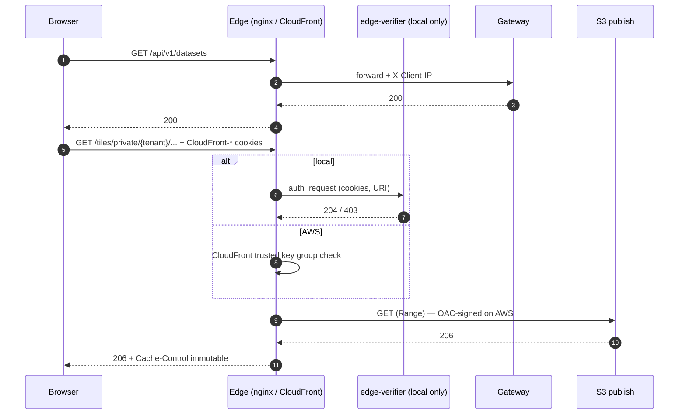

# Edge

The only internet-facing component. Locally it is nginx (`services/edge/`);
on AWS it is a CloudFront distribution (`deploy/terraform/cdn.tf`) and nginx is
deleted. Its routes:

| Path | Goes to |
|---|---|
| `/*` | static web app (`web/`, S3 `web` bucket on AWS) |
| `/api/*` | API gateway (internal ALB on AWS) |
| `/tiles/public/*` | serving bucket, as is |
| `/tiles/private/*` | serving bucket, only with a valid signed cookie |
| `/staging-upload/*` | staging bucket, presigned PUT (local only; on AWS the browser PUTs to S3 directly) |

It also owns response policy that belongs to the route rather than to the
bytes: `Cache-Control` (immutable for archives, 30 s for `/current`),
`Accept-Ranges`, and `X-Client-IP` for the gateway's rate limiter. Tracing
starts here.

## How it works

## Alternatives

| | Pros | Cons |
|---|---|---|
| **Chosen: CloudFront (nginx locally)** | Global cache for immutable tiles; native signed cookies; OAC keeps buckets private; no servers | Config is slow to change (distribution updates take minutes); nginx locally is a stand-in, not the same software |
| **ALB + nginx/Envoy pods in EKS** | Same software locally and in AWS; full control of routing and auth hooks | Every tile byte crosses the cluster and NAT-less egress is billed; no edge cache; pods to scale and patch |
| **API Gateway (AWS HTTP API) + S3 website** | Managed, per-request pricing, built-in throttling and JWT authorizers | Poor fit for range requests on large binaries (payload limits, no streaming cache); still needs a CDN in front for tiles |

## Cost

| Option | Estimate (eu-west-1, demo → 1 TB/month) |
|---|---|
| Chosen: CloudFront | $0 in the free tier (1 TB, 10M requests); beyond it $0.085/GB + $0.012/10k HTTPS requests → ≈ $85/TB. CloudFront Functions $0.10/1M after 2M free |
| ALB + proxy pods | ALB ≈ $18/month + LCUs, 2 proxy pods ≈ $7/month; data out $0.09/GB → ≈ $110/TB with no caching, and origin load grows with every read |
| API Gateway HTTP API | $1.00/1M requests + $0.09/GB out; a map view is dozens of range requests, so 10M reads ≈ $10 + data, plus a CDN anyway |
