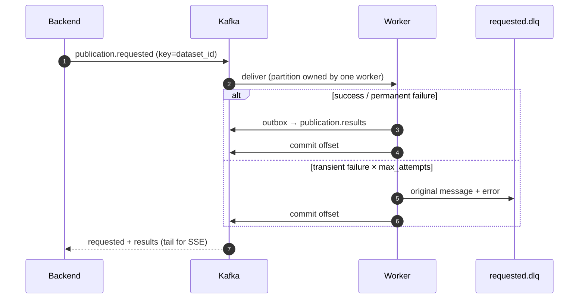

# Kafka

The event transport between the backend and the workers. Locally and in the
AWS demo it is a single Redpanda broker (Kafka protocol, no ZooKeeper); the
production target is Amazon MSK Serverless. The clients are the same either
way. Topics (`ops/kafka/kafka-init.sh`), all keyed by `dataset_id` so work for
one dataset stays ordered on one consumer:

| Topic | Produced by | Consumed by | Retention |
|---|---|---|---|
| `publication.requested` | backend; worker's reconciler (re-emit) | workers (group `publication-worker`); backend (SSE, throwaway groups) | 7 days |
| `publication.results` | worker, via the outbox | backend (SSE) | 7 days |
| `publication.requested.dlq` | worker (failed after retries, undecodable) | an operator (`make dlq`, runbook) | 30 days |

Delivery is at-least-once; correctness comes from the worker's conditional
claim and content-addressed writes, not from the broker. Event schemas are in
`docs/events/`, and `traceparent` travels in the message headers.

## How it works

## Alternatives

| | Pros | Cons |
|---|---|---|
| **Chosen: Kafka protocol (Redpanda demo / MSK prod)** | Ordered per dataset; replayable; consumer lag drives autoscaling; many consumers (workers + SSE) read the same stream | Heavyweight for this volume; MSK is the largest line item in prod; partitions cap worker parallelism |
| **Amazon SQS (+ SNS for fan-out)** | Fully managed, pay per request, native DLQ and visibility timeout (replaces leases), trivial IAM | No replay; SSE fan-out needs SNS + per-pod queues; FIFO ordering has throughput limits; ElasticMQ/LocalStack for local |
| **Postgres as the queue** (`SELECT … FOR UPDATE SKIP LOCKED` + `LISTEN/NOTIFY`) | No extra infrastructure; job row *is* the message, so the outbox and reconciler mostly disappear | Load on the primary DB; polling or NOTIFY limits; no lag metric for KEDA out of the box; harder to add independent consumers |

## Cost

| Option | Estimate (eu-west-1) |
|---|---|
| Chosen, demo: 1 Redpanda pod | ≈ $12/month of node capacity (250m / 1.5 Gi); no durability beyond the pod |
| Chosen, prod: MSK Serverless | ≈ $0.89/h ≈ $650/month (cluster-hour + 18 partitions), + $0.115/GB in, $0.0575/GB out |
| MSK provisioned 3 × kafka.t3.small | ≈ $0.15/h ≈ $110/month + $0.11/GB-month storage |
| SQS + SNS | $0.40/1M requests (SQS), $0.50/1M publishes (SNS); ≈ $0–1/month at demo volume, < $10/month at millions of jobs |
| Postgres queue | $0 extra at this scale; may force a larger RDS class later (db.t4g.small Multi-AZ ≈ $50/month) |
