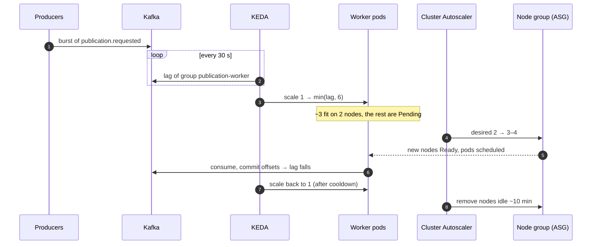

# Scaling

Each layer scales on the signal that actually measures its load, and the
heaviest traffic, tile reads, never reaches the cluster.

| Layer | Mechanism | Range | Signal |
|---|---|---|---|
| Tile reads | CloudFront cache | unlimited | — immutable URLs, ~90%+ hit ratio; misses are S3 GETs |
| `/current` lookups | CloudFront honours `Cache-Control: max-age=30` | — | one backend hit per dataset per 30 s per edge location |
| gateway, backend | HPA | 2–6 pods | CPU > 70% of requests (100m) |
| auth | fixed | 2 pods | — only `/internal/verify` on a 10 s cache miss, and sign-ins |
| worker | KEDA `ScaledObject` | 1–6 pods | consumer lag on `publication.requested`, threshold 1 (one job per pod) |
| nodes | Cluster Autoscaler | 2–4 × t3.large | pods `Pending` for lack of CPU/memory; idle nodes removed after ~10 min |

Worker pods request 500m CPU, what one job really uses (hashing + multipart
copy). Those honest requests are what make extra workers go `Pending`, which
is the Cluster Autoscaler's only trigger. The worker cap equals the partition
count (6): a seventh consumer in the group would get no partition.

Config: `deploy/helm/pmp/templates/services.yaml` (HPA),
`deploy/helm/pmp/templates/worker-scaling.yaml` (KEDA),
`deploy/terraform/eks.tf` (node group), `deploy/terraform/k8s.tf` (KEDA and
Cluster Autoscaler).

## How it works

## Limits (what breaks first)

| Bottleneck | When | Next step |
|---|---|---|
| Partitions (6) | > 6 jobs in parallel | Raise partitions first, then `worker.maxReplicas` |
| Node group max (4) | 6 workers + scaled API pods | Raise `max_size`; bigger nodes |
| RDS `db.t4g.micro` | connection pools × pods (HPA + workers) | RDS Proxy, then a larger class |
| Single Redpanda pod | broker restart or throughput | MSK (see [kafka](kafka.md)) |
| Rate limits per gateway pod | more replicas → looser effective limit | Shared state in ElastiCache |
| SSE streams per backend pod | many open job dashboards | Streams are cheap (one Kafka tail per pod); scale backend pods |

## Alternatives

| | Pros | Cons |
|---|---|---|
| **Chosen: HPA + KEDA + Cluster Autoscaler on one managed node group** | Standard, well-understood parts; lag-based worker scaling matches the real queue; predictable instance type and cost | Node scale-up takes 2–3 min; one instance type; no Spot; CA and ASG are two layers to reason about |
| **Karpenter instead of Cluster Autoscaler** | Provisions right-sized nodes in ~1 min, straight from pending pods; mixes instance types and **Spot**; consolidates underused nodes | More IAM and CRDs to own; Spot interruptions need the worker's lease/reconciler (already there); less predictable bill |
| **Fargate (or EKS Auto Mode) for workers** | No nodes to size or scale; pay per pod while a job runs; per-pod isolation | Fargate: ~30–60 s pod start, no DaemonSets (the ADOT collector needs a sidecar), higher per-vCPU price. Auto Mode: a management fee on top of EC2 |

## Cost

| Option | Idle | Full backlog (6 workers) |
|---|---:|---:|
| Chosen: 2–4 × t3.large on demand ($0.096/h each) | ≈ $0.43/h stack total | ≈ $0.53–0.62/h (+1–2 nodes, only while draining) |
| Karpenter with Spot | Same 2 on-demand base nodes | Extra capacity on Spot, typically 60–70% cheaper: ≈ $0.03–0.04/h per extra node instead of $0.096 |
| Fargate workers (0.5 vCPU, 1 GB) | −1 worker pod on the nodes | ≈ $0.03/h per running worker, $0 when the queue is empty; ≈ $0.001 per 2-min job |
| EKS Auto Mode | ≈ +12% on the EC2 price of managed nodes (≈ +$17/month for two) | Same, scales and consolidates automatically |

At demo volume scaling costs nothing extra: the backlog nodes live for
minutes. See [cost](../cost.md) for the whole stack.
