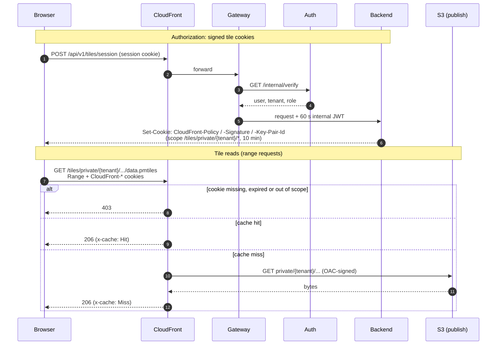

# Tile serving through CloudFront

Archives are served by CloudFront straight from the publish bucket; no
platform service is in the path of a tile read. Each archive has an
immutable, content-addressed URL, so CloudFront caches it for a year. The map
finds the current version through `/api/v1/datasets/{id}/current`.

- **Public** (`/tiles/public/*`): anyone can read; nothing to check.
- **Private** (`/tiles/private/*`): CloudFront requires signed cookies. The
  backend issues them only to a signed-in tenant member. They are scoped to
  `/tiles/private/{tenant}/*` and valid for 10 minutes.
- **Why cookies, not signed URLs:** a map reads one archive with many range
  requests. One cookie covers all of them, and the URL, which is the cache key,
  stays the same for every user.
- **Checked before the cache:** CloudFront verifies the cookie before it looks
  in the cache. Cookies are not part of the cache key, so a tenant's users share
  one cached copy, and a request without a valid cookie gets 403 even for
  cached bytes.
- **Not revocable:** a cookie cannot be revoked before it expires. A revoked
  session cannot get a new cookie.

Configuration: `deploy/terraform/cdn.tf`. Cookie signing:
`services/backend/src/pmp_backend/routers/tiles.py`.
