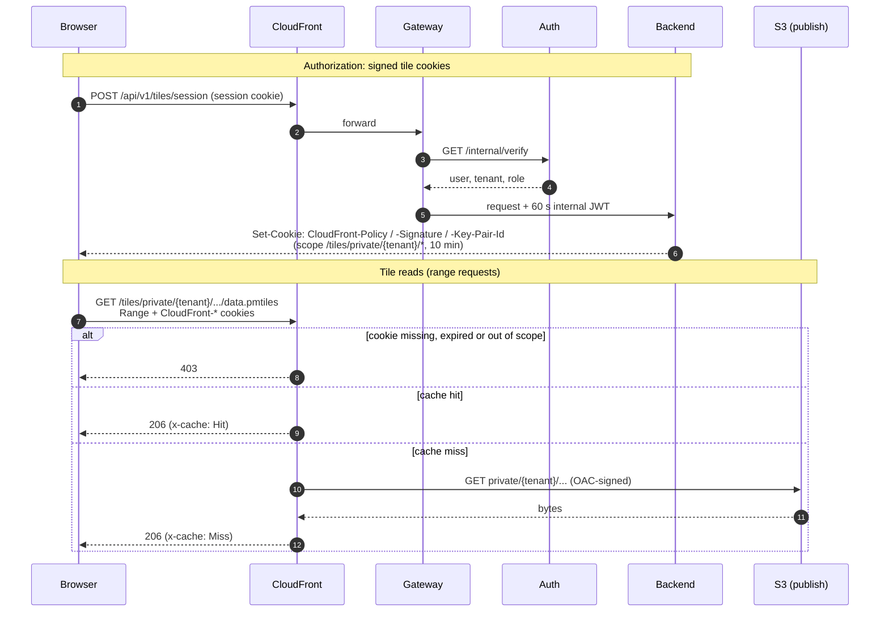
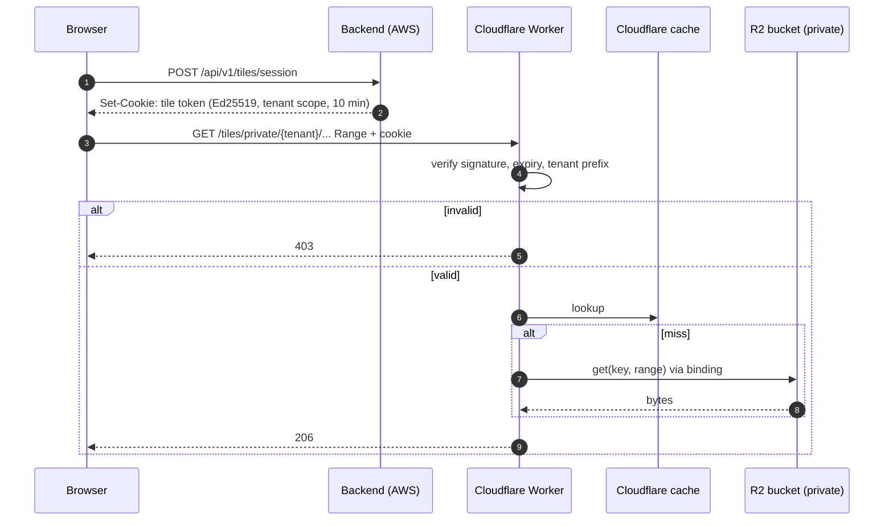

# Tile serving

Archives are served by the edge straight from the publish bucket; no platform
service is in the path of a tile read. Each archive has an immutable,
content-addressed URL, so it never goes stale: CloudFront keeps it up to 30
days before re-checking S3 (a cheap 304), and browsers a year (public) or
10 minutes (private). The map finds the current version through
`/api/v1/datasets/{id}/current` (cached 30 s).

- **Serving bucket** has no internet access; objects live under `public/` and
  `private/<tenant>/`. On AWS only CloudFront can read it (Origin Access
  Control); locally only nginx can, inside the compose network.
- **Public** (`/tiles/public/*`): anyone can read; nothing to check.
- **Private** (`/tiles/private/*`): signed cookies are required. The backend
  issues them only to a signed-in tenant member, scoped to
  `/tiles/private/{tenant}/*` and valid for 10 minutes. CloudFront checks them
  natively on AWS; locally the `edge-verifier` checks the same cookies with
  only the public key.
- **Why cookies, not signed URLs:** a map reads one archive with many range
  requests. One cookie covers all of them, and the URL, which is the cache key,
  stays the same for every user.
- **Checked before the cache:** CloudFront verifies the cookie before it looks
  in the cache. Cookies are not part of the cache key, so a tenant's users share
  one cached copy, and a request without a valid cookie gets 403 even for
  cached bytes.
- **Not revocable:** a cookie cannot be revoked before it expires. A revoked
  session cannot get a new cookie.

## How it works

Configuration: `deploy/terraform/cdn.tf`. Cookie signing:
`services/backend/src/pmp_backend/routers/tiles.py`.

## Alternatives

| | Pros | Cons |
|---|---|---|
| **Chosen: CDN + signed cookies over the raw `.pmtiles` archive** | No compute on the read path; one cached object per archive; range requests; native tenant isolation at the edge | Not revocable within the 10-min TTL; client must speak PMTiles; cookie scope is per tenant, not per dataset |
| **Tile server (e.g. `go-pmtiles serve`, Martin) behind the API** returning `/{z}/{x}/{y}.mvt` | Any MapLibre/Leaflet client works; per-request authorization (instant revocation, per-dataset rules) | Compute and egress on every uncached tile; per-tile auth defeats shared caching; another service to scale |
| **CloudFront signed URLs / Lambda@Edge authorizer** | Per-dataset or per-user scope; Lambda@Edge can check a JWT or even revocation lists | Signed URLs change the cache key per user (cache fragmentation) and need re-signing; Lambda@Edge adds latency and per-request cost on every range read |

## Cost

| Option | Estimate |
|---|---|
| Chosen: S3 + CloudFront | S3 $0.0245/GB-month stored; CloudFront free up to 1 TB/10M requests per month, then ≈ $0.085/GB + $0.012/10k requests. S3 GETs only on cache misses ($0.00043/1k) |
| Tile server pods | 2 × (250m / 512 Mi) ≈ $18/month idle, scaling with uncached traffic; still pays CloudFront or $0.09/GB direct egress |
| Lambda@Edge authorizer | $0.60/1M invocations + $0.00005001/GB-s; a map view is ~50–200 range requests → 10M reads ≈ $6–10/month on top of CloudFront |

## AWS (CloudFront + S3) vs Cloudflare R2

The brief asks for this comparison. **CloudFront + S3 is implemented**; R2 is
the documented switch once tile traffic reaches several TB a month.

### Assumptions

| | Value |
|---|---|
| Stored archives | 50 GB (all versions; the sample is 7 MB, real archives up to a few GB) |
| One map view | ~100 range requests, ~50 KB each → ~5 MB |
| Cache hit ratio | 90% — URLs are content-addressed and immutable, so nothing is ever purged |
| Traffic tiers | **S** 10k views/month (1M requests, 50 GB) · **M** 200k views (20M requests, 1 TB) · **L** 2M views (200M requests, 10 TB) |
| Private share | Worst case: every request needs the private check |
| Prices | List prices, USD, excl. tax. AWS eu-central-1; Cloudflare Free zone plan + Workers Paid |

### Monthly cost

| Tier | CloudFront + S3 (chosen) | R2, public only | R2 + Worker for private tiles |
|---|---:|---:|---:|
| **S** — 50 GB out, 1M requests | ≈ $1 | ≈ $1 | ≈ $6 |
| **M** — 1 TB out, 20M requests | ≈ $14 | ≈ $1 | ≈ $9 |
| **L** — 10 TB out, 200M requests | ≈ $1,020 | ≈ $5 | ≈ $70 |

How the numbers are made:

- **CloudFront + S3:** 1 TB and 10M requests free, then $0.085/GB and
  $0.012 per 10k HTTPS requests; S3 storage $0.0245/GB-month; S3 GETs only on
  misses ($0.00043/1k). At **L**: 9 TB × $0.085 ≈ $780 + 190M requests ≈ $230
  + misses and storage ≈ $10.
- **R2:** storage $0.015/GB-month (10 GB free), **no egress fee**; reads on
  cache misses are Class B ops, $0.36/M after 10M free. Cloudflare's cache in
  front of a custom-domain bucket is free.
- **Worker for private tiles:** Workers Paid $5/month includes 10M requests,
  then $0.30/M. The Worker runs on *every* request, including cache hits,
  because it must check the token before serving.
- **Cross-cloud copy (R2 only):** the worker runs in AWS, so publishing to R2
  pays AWS internet egress, $0.09/GB of *new* archives (≈ $5 per 50 GB
  published).

Idle cost of either option is ≈ $0. At demo volume (**S**) both are rounding
errors next to the ≈ $315/month EKS stack ([cost](../cost.md)).

### Private tiles on R2

R2 has no equivalent of CloudFront's trusted key groups, so the check becomes
our code at the edge — the local `edge-verifier` ported to a Worker:

### Comparison

| | CloudFront + S3 (chosen) | Cloudflare R2 |
|---|---|---|
| **Cost** | Egress dominates: ≈ $85/TB after the first free TB | No egress fees; flat at any traffic. Cheaper from ~1 TB/month, ~$1,000/month cheaper at 10 TB |
| **Performance** | Global PoPs, Origin Shield available; caches objects up to 50 GB and serves ranges from cache | Larger PoP network; but on non-Enterprise plans objects **over 512 MB are not cached**, so big archives go to R2 on every range read (no egress fee, but higher latency and Class B ops) |
| **Security** | OAC keeps the bucket private; signed cookies checked natively; workloads use IAM via Pod Identity — **no long-lived credentials** | R2 API tokens are long-lived secrets the AWS worker must hold (no IAM federation); private access is custom Worker code we own and must test; a second account and blast radius |
| **Operational effort** | One provider, one Terraform provider, one IAM model, one bill; already implemented | Second vendor: Cloudflare account, DNS zone for the custom domain, Terraform `cloudflare` provider, Worker deploys, split logs/metrics and billing |
| **Code change** | — | Small: the worker already writes through the S3 API (endpoint + credentials); the cookie issuer changes format; add the Worker |

### Decision

**CloudFront + S3** for now. At the expected demo and early-customer volume
(**S**–**M**) the two cost about the same, while AWS keeps the brief's security
requirements simple: no long-lived cloud credentials, private tiles enforced
by a managed feature rather than our own edge code, and one provider to
operate.

**Revisit when** tile egress passes ~2–3 TB/month (the saving then exceeds a
few hundred dollars a month), provided archives stay under 512 MB or an
Enterprise plan is justified. The switch is additive: publish to R2 as a
second target, move DNS, deploy the verifying Worker, then retire the
CloudFront behaviours.
