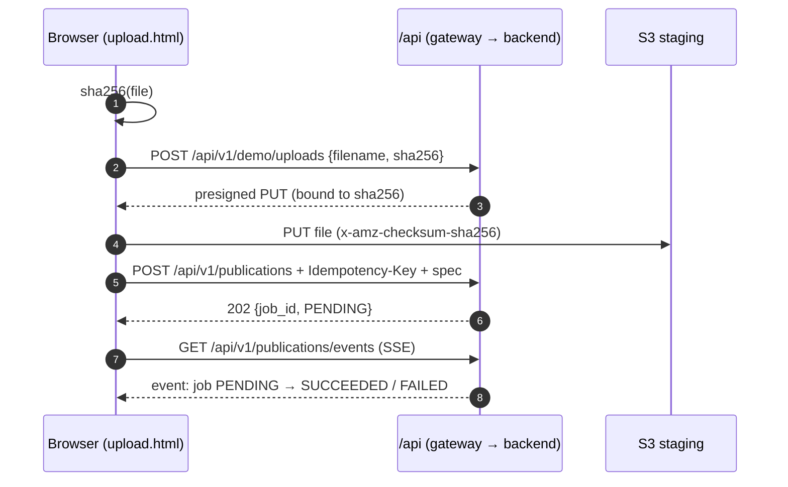
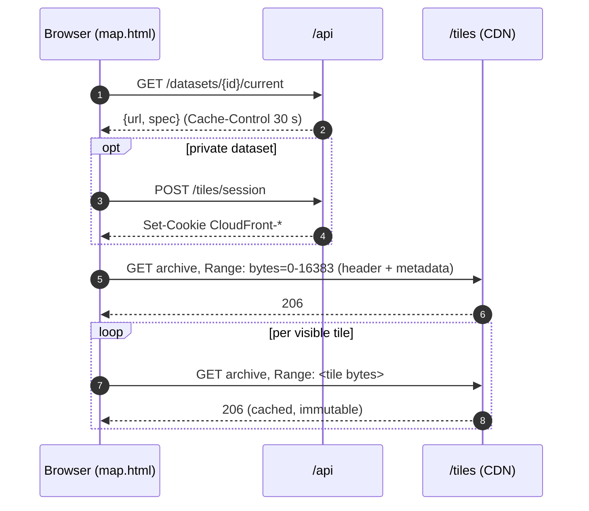

# Web app

Three static pages in `web/` (plain HTML + ES modules, no build step), served
by the edge from the same origin as the API and the tiles:

- **`/` Datasets** — sign-in form and the dataset list. Anonymous visitors see
  public datasets; a signed-in user also sees their tenant's private ones,
  their versions and a *Make current* (rollback) button.
- **`/upload.html` Upload** — only when `DEMO_UPLOAD_ENABLED=true`. Stages a
  `.pmtiles` file with a presigned PUT, submits the publication with its spec,
  and shows the tenant's jobs live over SSE, with retry for failed ones.
- **`/map.html` Map** — MapLibre + the PMTiles protocol. Resolves the dataset's
  current version, reads the archive with range requests and builds the style
  from the archive's own metadata, overridden by the published spec.

Same origin means no CORS, and the session cookie and the tile cookies are
sent automatically.

## How it works

## Alternatives

| | Pros | Cons |
|---|---|---|
| **Chosen: static pages, no build** | Nothing to compile or deploy but files in a bucket; trivially cacheable; easy to read in a review | No components or type checking; would not scale to a large UI |
| **SPA framework (React/Vite)** | Typed components, routing, a real design system; standard for a product team | Build pipeline, bundle to maintain, more code than the demo needs; same hosting cost |
| **Server-rendered pages (backend templates)** | One deployable; SEO-friendly; no separate bucket | Puts UI load on the API pods; couples UI and API releases; loses CDN-only hosting |

## Cost

| Option | Estimate (eu-west-1) |
|---|---|
| Chosen: S3 `web` bucket + CloudFront | ≈ $0 — a few hundred KB in S3; requests inside CloudFront's free tier (1 TB, 10M requests/month) |
| SPA framework | ≈ $0 hosting (same bucket); CI build minutes only |
| Server-rendered | ≈ $3–7/month more API pod capacity at demo load (100m CPU per replica on t3.large nodes), growing with traffic instead of being absorbed by the CDN |
