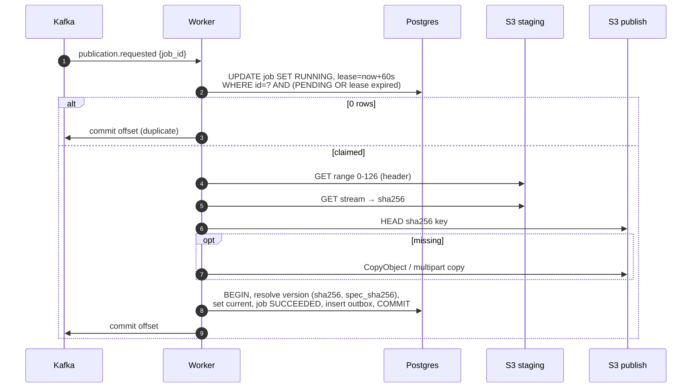
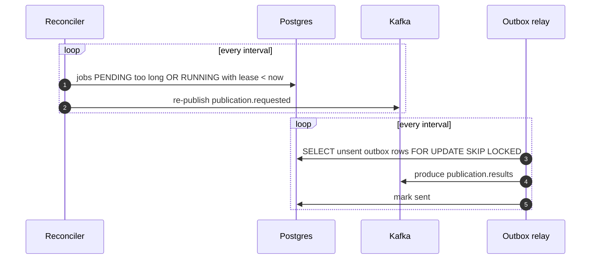

# Worker

A plain-Python Kafka consumer (`services/worker/`), one job in flight per
process, scaled on consumer lag. It is the only writer of the publish bucket
and of dataset versions. Three loops run in each process:

- **Processing** (`runner.py`)
  1. Consume `publication.requested`.
  2. **Claim** the job with one conditional `UPDATE` (pending, or running with
     an expired lease). No row → duplicate or racing worker → commit offset,
     done.
  3. Validate the PMTiles header (one 127-byte range read), stream-hash the
     archive.
  4. Server-side copy to a **content-addressed** key in the publish bucket;
     skipped if already there, so retries are idempotent.
  5. Resolve the version by `(archive sha256, spec sha256)`:
     active → `DEDUPLICATED`; exists but inactive → make it current; new →
     create it.
  6. In **one transaction**: version, dataset pointer, job status and the
     result event in the outbox.
  7. Commit the Kafka offset only after the job is terminal.
  - Transient errors: in-process retries with full-jitter backoff; after
    `max_attempts` (5) the job fails and the message goes to the DLQ.
    Permanent errors (not a PMTiles file) fail without the DLQ.
- **Lease heartbeat** (`lease.py`) — renews the 60 s lease every 20 s while a
  job runs, so the lease bounds only dead-worker recovery, not job length.
- **Reconciler** (`reconciler.py`) — finds `PENDING` jobs older than a
  threshold (lost event) and `RUNNING` jobs with an expired lease (OOMKilled,
  scaled-down node) and re-publishes `publication.requested`.
- **Outbox relay** (`outbox.py`) — publishes result events from the outbox
  table to `publication.results`.

## How it works

## Alternatives

| | Pros | Cons |
|---|---|---|
| **Chosen: long-running consumer pods (KEDA on lag)** | No time limit per job; streams GB-sized files with flat memory; same code locally and on EKS; crash recovery proven by chaos tests | Pods and nodes to run even when idle (min 1 replica); we own retry/lease logic |
| **Lambda triggered by S3 event / SQS** | Zero idle cost, per-ms billing, managed retries and DLQ | 15-min and 10 GB `/tmp` limits; S3 event triggers bypass the idempotent job API; cold starts; differs from local |
| **AWS Batch / ECS Fargate task per job** | Isolation per job, any size and duration, no cluster capacity planning | 30–60 s start latency per job; orchestration (Step Functions/EventBridge) needed; per-task overhead for small files |

## Cost

| Option | Estimate (eu-west-1) |
|---|---|
| Chosen: 1–6 pods × 500m / 512 Mi | 1 idle pod ≈ $17/month of t3.large capacity; a full backlog (6 pods) adds 1–2 nodes ≈ $0.09–0.18/h while it drains |
| Lambda | 2 GB × 60 s per job ≈ $0.002/job → 10k jobs ≈ $20/month; $0 idle. Plus SQS ≈ $0.40/1M requests |
| Fargate task per job | 0.5 vCPU / 1 GB ≈ $0.025/h → ≈ $0.001 per 2-min job; 10k jobs ≈ $10/month; $0 idle, but Step Functions/EventBridge extra |
